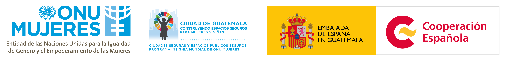

<!-- Add link to logo -->
<script>
  $('.navbar-logo').each(function() {
    var link = $(this).html();
    $(this).contents().wrap('<a href="http://ocacgt.org/" target="_blank"></a>');
  });
</script>
    

```{r setup, include=FALSE}
# Load used packages`
library(package = "tidyverse")
library(package = "patchwork")
library(package = "leaflet")

# Switch off spherical geometry
sf::sf_use_s2(FALSE)

# Theme palette
ocacgt_pal <- c(
  morado = "#851264",
  gris = "#605f61",
  anaranjado = "#ff7e00",
  rojo = "#b62745",
  amarillo = "#ffcd34",
  negro = "#262626",
  gris = "#c7c7c7",
  blanco = "#f3f3f3"
)

# Configure figures
theme_set(
  theme_classic() +
    theme(
      title = element_text(face = "bold")
    )
)

# Configure knitting
knitr::opts_chunk$set(echo = FALSE, message=FALSE, warning=FALSE)
```


```{r utils}
# Load utility functions
source(file = "scripts/helpers.R", encoding = "UTF8")
```


```{r load_data, include=FALSE}
# Data preprocessing script
source(file = "scripts/get-data.R", encoding = "UTF8")

# Data processing for USAC report
source(file = "scripts/read-form-data.R", encoding = "UTF-8")
source(file = "scripts/prepare-gis-data.R", encoding = "UTF-8")
ref <- readxl::read_excel("output/locations_ref.xlsx")
```


```{r, results='asis'}
if(knitr::is_html_output()){
  cat(
    "**¡Hola!**",
    "================================================",
    "",
    '<style>',
    '.videoWrapper {',
    '	position: relative;',
    '	padding-bottom: 56.25%; /* 16:9 */',
    '	padding-top: 25px;',
    '	height: 0;',
    '}',
    '.videoWrapper iframe {',
    '	position: absolute;',
    '	top: 0;',
    '	left: 0;',
    '	width: 100%;',
    '	height: 100%;',
    '}',
    '</style>',
    '',
    '',
    '<div class="videoWrapper">',
    '<iframe',
    '  width="560" height="315" align="center"',
    '  src="https://www.youtube.com/embed/NkrRpN_5GIo"',
    '  data-external="1"',
    '  frameborder="0" allow="autoplay; encrypted-media" allowfullscreen>',
    '</iframe>',
    '</div>',
    sep = "\n"
  )
} else {
  cat(
    "# Informe descargable  ",
    paste("Documento generado el", lubridate::today(), "\n"),
    "Este documento muestra los resultados de los estudios del acoso callejero en Guatemala y el acoso callejero en el transporte público.",
    sep = "\n"
  )
}
```


**Acoso callejero** {.storyboard}
================================================


### **¿En dónde ocurre al acoso?** </br>El acoso callejero ocurre principalmente en las calles, seguido del [transporte público](#estudio-de-acoso-en-el-transporte-público).


`r if(knitr::is_html_output()) "En el mapa de abajo" else "En el mapa disponible en el dashboard (http://mapeo.ocacgt.org/indicadores.html)"`  puedes observar el lugar donde ocurrió cada reporte de acoso recibido en este estudio.
Explóralo para ver los lugares donde más ocurre,
y también donde has vivido el acoso para asegurarte de que esté reportado.
Si ves que un lugar en particular no ha sido reportado,
te invitamos a <a href="http://ocacgt.org/mapeo-de-acoso-callejero/" target="_blank">llenar este formulario</a>
para actualizar esta información.


\newpage


```{r fig.width=8, fig.height=8.5}
if(knitr::is_html_output()){
  # Set tile options
  base_tiles <- "carto-light"
  
  tiles <- tribble(
    ~tile,         ~url,
    "wikimedia",   "https://maps.wikimedia.org/osm-intl/{z}/{x}/{y}.png",
    "transport",   "http://{s}.tile.opencyclemap.org/transport/{z}/{x}/{y}.png",
    "carto-toner", "http://a.tile.stamen.com/toner/{z}/{x}/{y}.png",
    "carto-light", "http://a.basemaps.cartocdn.com/light_all/{z}/{x}/{y}.png"
  )
  
  if(!base_tiles %in% tiles$tile){
    tiles <- tiles %>%
      bind_rows(
        data_frame(
          tile = base_tiles,
          url = paste0("http://{s}.api.cartocdn.com/", base_tiles, "/{z}/{x}/{y}.png")
        )
      )
  }
  
  
  # Draw map
  locations %>%
    mutate(
      label = paste0(as.Date(timestamp), "</br>", harassment_location)
    ) %>%
    leaflet(width = "100%", height = "100%") %>% # width = "100%", height = "100%"
    fitBounds(
      lat1 = set_names(gt_bbox$ymin, NULL) - 0.06,
      lng1 = set_names(gt_bbox$xmin, NULL) + 0.01,
      lat2 = set_names(gt_bbox$ymax, NULL) + 0.06,
      lng2 = set_names(gt_bbox$xmax, NULL) - 0.01
    ) %>%
    addTiles(
      urlTemplate = tiles[tiles$tile==base_tiles,]$url
    ) %>%
    addCircleMarkers(
      lng = ~lon, lat = ~lat, popup = ~label,
      clusterOptions = markerClusterOptions(),
      radius = 6,
      labelOptions = labelOptions(textOnly = FALSE),
      options = popupOptions(closeButton = FALSE)
    ) %>%
    addControl(
      htmltools::span(
        htmltools::tag("b", "Figura 1:"),
        "Mapa de casos reportados"
      ),
      position = "topright"
    )
} else {
  plot(static_map)
}

```


```{r, results='asis'}
if(!knitr::is_html_output()){
  cat(
    "",
    "",
    "Como el municipio de Guatemala, departamento de Guatemala,",
    "es el que cuenta con más de casos",
    paste0(
      "(",
      municipality_reports %>%
        as_tibble() %>%
        summarize(
          text = paste0(
            n[municipality == "Guatemala"],
            " de ",
            sum(n, na.rm = TRUE),
            " casos reportados con ubicación, ",
            round(n[municipality == "Guatemala"] / sum(n, na.rm = TRUE) * 100, 1),
            "%"
          )
        ),
      ")"
    ),
    "en la figura 1b se muestra el detalle de casos por cada zona.",
    "",
    "",
    sep = "\n"
  )
}
```


```{r}
if(!knitr::is_html_output()){
  plot(static_zones_map)
}
```


***

```{r places, fig.width=4, fig.height=4}

dashboard_calle %>%
  mutate(
    harassment_place_rec = harassment_place_rec %>%
      fct_relabel(
        function(x) x %>%
          gsub("( [(].+)|(cerca de )", "", .) %>%
          gsub(".+(otros)", "otros", .) %>%
          gsub(" (público|de buses)", "\n\\1", .)
      )
  ) %>%
  ggplot() +
  geom_bar(
    aes(x = harassment_place_rec), fill = ocacgt_pal["gris"]
  ) +
  labs(
    title = "Figura 2:\nLugares donde es más\nfrecuente el acoso.",
    subtitle = paste(
      "El acoso ocurre en todas partes, pero hay",
      "lugares en donde es más frecuente. En la",
      "gráfica de abajo puedes ver los tipos de",
      "lugares más reportados en este estudio.",
      sep = "\n"
    ),
    x = "Tipo de lugar\ndonde ocurrió el acoso",
    y = "Número de reportes"
  ) +
  scale_y_continuous(expand = c(0, 0)) +
  # coord_flip() +
  theme(
    legend.position = "bottom",
    axis.text.x = element_text(angle = 90, hjust = 0, vjust = 0.5)
  )
```


### **¿A quiénes afecta el acoso callejero?** </br>Quienes principalmente viven el acoso callejero son las mujeres.

```{r}
# Harassed sex
percent <- dashboard_calle %>%
  count(reporter_sex) %>%
  mutate(
    sex = recode(
      reporter_sex,
      Mujer = "mujeres",
      Hombre = "hombres"
    ),
    percent = as.integer(round(n / sum(n) * 100, 0))
  ) %>%
  select(sex, percent) %>%
  spread(sex, percent)

# Harasser sex
harassers <- dashboard_calle %>%
  count(harasser_sex) %>%
  mutate(n = round(n / sum(n) *100, 0)) %>%
  spread(harasser_sex, n) %>%
  set_names(tolower(names(.)))

totals <- dashboard_calle %>%
  mutate(
    sex =recode(reporter_sex, Mujer = "mujeres", Hombre = "hombres")
  ) %>%
  count(sex) %>%
  arrange(desc(n))


ages <- dashboard_calle %>%
  filter(reporter_sex == "Mujer") %>%
  pull(reporter_age) %>%
  quantile(c(0.1, 0.9), na.rm = TRUE) %>%
  paste(., collapse = " y ")
  

dashboard_calle %>%
  mutate(
    reporter_sex = factor(reporter_sex, levels = c("Mujer", "Hombre"))
  ) %>%
  plot_square_waffle(
    variable = reporter_sex,
    label = "Sexo de persona acosada",
    colors = ocacgt_pal[c("morado", "gris")],
    reverse = TRUE
  ) +
  labs(
    title = "Figura 3:\nNúmero de casos reportados."
  )
```

***

Entre los reportes de acoso callejero
`r percent$mujeres`% de las personas afectadas son mujeres,
mientras que solamente `r percent$hombres`% son hombres.
En total hemos recibido
`r paste(glue::glue_data(totals, "{n} reportes de {sex}"), collapse = " y ")`.


### **¿A cuáles grupos de edad afecta?** </br>La mayoría de las personas acosadas son mujeres entre `r ages` años de edad.

```{r}
dashboard_calle %>%
  ggplot() +
  geom_histogram(
    aes(x = reporter_age, fill = reporter_sex),
    binwidth = 1, center = 0.5
  ) +
  # Annotate with grids
  geom_hline(
    yintercept = dashboard_calle %>%
      count(reporter_age) %>%
      pull(n) %>%
      max(na.rm = TRUE) %>%
      seq(1, .),
    color = ocacgt_pal["blanco"], size = 0.3
  ) +
  geom_vline(
    xintercept = seq(
      min(dashboard_calle$reporter_age, na.rm = TRUE),
      max(dashboard_calle$reporter_age, na.rm = TRUE)
    ),
    color = ocacgt_pal["blanco"], size = 0.3
  ) +
  labs(
    title = "Figura 4:\nNúmero de reportes por\nedad de persona acosada.",
    x = "Edad en años",
    y = "Número de reportes",
    fill = "Sexo de la persona acosada"
  ) +
  scale_fill_manual(values = set_names(ocacgt_pal[2:1], NULL)) +
  scale_x_continuous(expand = c(0, 0)) +
  scale_y_continuous(expand = c(0, 0)) +
  coord_equal() +
  theme(
    legend.position = "bottom",
    legend.direction = "vertical"
  )

# Summarize ages
ages_table <- dashboard_calle %>%
  filter(!is.na(reporter_age)) %>%
  mutate(
    age_group = cut(
      reporter_age,
      breaks = seq(0, max(ceiling(reporter_age / 10) * 10), by = 10)
    ),
    reporter_sex = recode(
      reporter_sex,
      Hombre = "los hombres",
      Mujer = "las mujeres"
    )
  ) %>%
  group_by(reporter_sex, age_group) %>%
  summarize(
    min_age = min(reporter_age),
    n = n()
  ) %>%
  extract(
    age_group, into = c("start", "end"), convert = TRUE,
    regex = "([0-9]+)[^0-9]+([0-9]+)", remove = FALSE
  ) %>%
  mutate(
    age_group = paste(pmax(start, min_age), end, sep = " a "),
    percent = as.integer(round(n / sum(n) * 100, 0))
  ) %>%
  ungroup() %>%
  complete(
    nesting(reporter_sex, age_group),
    fill = list(n = 0, percent = 0)
  )
```

***

Entre los reportes que se han recopilado en este estudio las edades han ido de
`r paste(range(dashboard_calle$reporter_age), collapse = " a ")` años y
los grupos de edad que más han reportado acoso son
`r ages_table %>% slice(which.max(percent)) %>% glue::glue_data("{age_group} años para {tolower(reporter_sex)}") %>% paste(collapse = ", y ")`.


```{r}
ages_counts <- ages_table %>%
  ungroup() %>%
  mutate(reporter_sex = gsub("l[oa]s ", "", reporter_sex)) %>%
  split(.$reporter_sex) %>%
  map(
    .f = function(x) {
      mutate(
        x,
        percent = paste0(percent, "%")
      ) %>%
        select(
          "Grupo de edad (años)" = age_group,
          "Reportes de acoso" = n,
          "Porcentaje del total para el sexo" = percent
        )
    }
  )
```


<!-- Tab links -->

<span style="color:#999999"><b>Tabla 1:</b> Reportes de acoso por grupo de edad, para cada sexo.</span>


```{r, results='asis', eval=knitr::is_html_output()}
cat(
'<div>',
'<ul class="nav nav-tabs">',
'<li class="active"><a data-toggle="tab" href="#e-mujeres">Mujeres</a></li>',
'<li><a data-toggle="tab" href="#e-hombres">Hombres</a></li>',
'</ul>',
'<div class="tab-content">',
'<div id="e-mujeres" class="tab-pane fade in active">',
kable(ages_counts$mujeres, caption = "**Mujeres**"),
'</div>',
'<div id="e-hombres" class="tab-pane fade">',
kable(ages_counts$hombres, caption = "**Hombres**"),
'</div>',
'</div>',
'</div>',
# '</div>',
sep = "\n"
)
```


```{r, eval=!knitr::is_html_output()}
kable(ages_counts$mujeres, caption = "**Mujeres**")
kable(ages_counts$hombres, caption = "**Hombres**")
```


### **¿Quiénes perpetran el acoso callejero?** </br> Según los casos reportados, los hombres son quienes más realizan prácticas de acoso (`r harassers$hombre`%), con relación a los casos registrados de mujeres acosadoras (`r harassers$mujer`%).

```{r}
dashboard_calle %>%
  plot_square_waffle(
    variable = harasser_sex, label = "Sexo del acosador",
    colors = ocacgt_pal[c("gris", "morado")]
  ) +
  labs(
    title = "Figura 5:\nNúmero de reportes por\nsexo del acosador."
  )
```

***

La mayoría de los reportes que hemos recibido en el estudio del acoso callejero
indican que el acosador era un hombre.

En la figura de abajo puedes ver que cerca de la mitad de los hombres acosadores
estaban en el rango de 25 a 34 años de edad.
Los números en las barras representan el porcentaje de acosadores para cada
grupo de edad, según su sexo.

```{r fig.width=6, fig.height=6}
dashboard_calle %>%
  mutate(
    harasser_sex = factor(harasser_sex, levels = c("Mujer", "Hombre"))
  ) %>%
  group_by(harasser_sex, harasser_age) %>%
  summarize(n = n()) %>%
  mutate(
    percent = paste(as.integer(round(n / sum(n) * 100, 0)), "%")
  ) %>%
  ungroup() %>%
  mutate(
    max_age = harasser_age[which.max(n)]
  ) %>%
  group_by(harasser_age) %>%
  mutate(
    midpoint = ifelse(
      test = harasser_sex == "Hombre",
      yes = n / 2,
      no = ifelse(
        test = harasser_age == max_age,
        yes = sum(n) - 2,
        no = sum(n) + 1
      )
    ),
    baseline = ifelse(
      test = harasser_sex == "Mujer" & harasser_age == max_age,
      yes = 0,
      no = 0.5
    ),
    color = ifelse(
      test = harasser_sex == "Hombre",
      yes = ocacgt_pal["negro"],
      no = ifelse(
        test = harasser_age == max_age,
        yes = ocacgt_pal["blanco"],
        no = ocacgt_pal["morado"]
      )
    )
  ) %>%
  ungroup() %>%
  ggplot() +
  geom_col(
    aes(x = harasser_age, y = n, fill = harasser_sex)
  ) +
  geom_text(
    aes(
      x = harasser_age, y = midpoint, color = I(color),
      label = percent#, vjust = baseline
    ),
    show.legend = FALSE
  ) +
  labs(
    title = "Figura 6:\nNúmero de acosadores\nreportados por grupo de edad.",
    x = "Edad estimada del acosador",
    y = "Porcentaje de acosadores",
    fill = "Sexo del acosador"
  ) +
  scale_fill_manual(values = set_names(ocacgt_pal, NULL)) +
  scale_x_discrete(expand = c(0, 0)) +
  scale_y_continuous(expand = c(0, 0)) +
  theme(
    legend.position = c(1, 1),
    legend.justification = c(1, 1)
  )
```


### **¿Cuáles son los tipos de acoso más reportados?** </br>El tipo de acoso más reportado es el llamado piropo, que son expresiones no solicitadas y violentas.

```{r}
# Count types
harassment_counts <- dashboard_calle %>%
  select(reporter_sex, harassment_type_rec) %>%
  rownames_to_column() %>%
  group_by(reporter_sex) %>%
  mutate(n = n()) %>%
  unnest(harassment_type_rec) %>%
  mutate(
    harassment_type_rec = harassment_type_rec %>%
      gsub("\"", "", .) %>%
      gsub(" y graba.+", "", .) %>%
      gsub(" con.+", "", .) %>%
      gsub(" [(].+", "", .) %>%
      gsub(" y ", " y\n", .)
  ) %>%
  group_by(reporter_sex, harassment_type_rec) %>%
  summarize(
    n = first(n),
    times = n(),
    percent = as.integer(round(times / first(n) * 100, 0))
  ) %>%
  ungroup() %>%
  mutate(
    harassment_type_rec = harassment_type_rec %>%
      fct_reorder(times, .fun = sum) %>%
      fct_reorder(. != "otro")
  ) %>%
  arrange(reporter_sex, desc(harassment_type_rec))

# Plot types
harassment_counts %>%
  ggplot() +
  geom_col(
    aes(x = harassment_type_rec, y = times, fill = reporter_sex)
  ) +
  labs(
    title = "Figura 7:\nFrecuencia de\ncada tipo de acoso.",
    x = "Tipo de acoso",
    y = "Número de reportes",
    fill = "Sexo de la\npersona acosada"
  ) +
  scale_fill_manual(values = set_names(ocacgt_pal[2:1], NULL)) +
  scale_y_continuous(expand = c(0, 0)) +
  coord_flip() +
  theme(
    legend.position = c(1, 0),
    legend.justification = c(1, -0.1)
  )
```

***

En esta tabla puedes ver la cantidad de reportes que incluía cada uno de los
5 tipos más comunes de acoso callejero, por sexo de la persona acosada:

```{r}
types_counts <- harassment_counts %>%
  group_by(reporter_sex) %>%
  mutate(
    row = 1:n()
    # harassment_type_rec = ifelse(
    #   test = row > 5 & reporter_sex == "Hombre",
    #   yes = "otro",
    #   no = gsub("\n", " ", as.character(harassment_type_rec))
    # )
  ) %>%
  ungroup() %>%
  mutate(
    harassment_type_rec =  harassment_type_rec %>%
      gsub("\n", " ", .) %>%
      factor(., levels = unique(.), ordered = TRUE)
  ) %>%
  group_by(reporter_sex, harassment_type_rec) %>%
  summarize(
    n = first(n),
    times = sum(times)
  ) %>%
  ungroup() %>%
  complete(reporter_sex, harassment_type_rec, fill = list(n = 1, times = 0)) %>%
  mutate(
    harassment_type_rec =  harassment_type_rec %>%
      factor() %>%
      fct_reorder(times, .fun = sum) %>%
      fct_reorder(. != "otro")
  ) %>%
  arrange(reporter_sex, desc(times)) %>%
  split(.$reporter_sex) %>%
  map(
    .f = function(x){
      mutate(
        x,
        percent = paste0(round(times / n * 100, 1), "%")
      ) %>%
        select(
          "Tipo de acoso" = harassment_type_rec,
          "Número de reportes" = times,
          "Porcentaje de reportes" = percent
        )
    }
  )
```


<!-- Tab links -->

<span style="color:#999999"><b>Tabla 2:</b> Reportes de tipo de acoso para cada sexo.</span>


```{r, results='asis', eval=knitr::is_html_output()}
cat(
'<div>',
'<ul class="nav nav-tabs">',
'<li class="active"><a data-toggle="tab" href="#ta-mujeres">Mujeres</a></li>',
'<li><a data-toggle="tab" href="#ta-hombres">Hombres</a></li>',
'</ul>',
'<div class="tab-content">',
'<div id="ta-mujeres" class="tab-pane fade in active">',
kable(types_counts$Mujer, caption = "**Mujeres**"),
'</div>',
'<div id="ta-hombres" class="tab-pane fade">',
kable(types_counts$Hombre, caption = "**Hombres**"),
'</div>',
'</div>',
'</div>',
# '</div>',
sep = "\n"
)
```


```{r, eval=!knitr::is_html_output()}
kable(types_counts$Mujer, caption = "**Mujeres**")
kable(types_counts$Hombre, caption = "**Hombres**")
```


En el cuestionario es posible reportar varios tipos de acoso a la vez,
porque cada evento de acoso generalmente puede incluir varias expresiones
de violencia distintas.
Estos datos reflejan el porcentaje de reportes que incluian cada tipo de acoso
común, por lo que los valores deben considerarse por separado ya que no
representan juntos el 100%.


### **¿Qué tan frecuente es el acoso callejero?** </br>El acoso callejero es reportado muchas veces, y típicamente sucede más de una vez al día.

```{r}
g <- dashboard_calle %>%
  count(reporter_sex, harassment_frequency) %>%
  mutate(
    harassment_frequency = harassment_frequency %>%
      fct_reorder(n, .fun = sum)
  ) %>%
  ggplot() +
  geom_col(
    aes(x = harassment_frequency, y = n, fill = reporter_sex)
  ) +
  labs(
    title = "Figura 8:\nNúmero de casos según\nfrecuencia de acoso.",
    x = "Frecuencia del acoso",
    y = "Número de reportes",
    fill = "Sexo de la\npersona acosada"
  ) +
  scale_y_continuous(expand = c(0, 0)) +
  scale_fill_manual(values = set_names(ocacgt_pal[2:1], NULL)) +
  coord_flip() +
  theme(
    legend.position = c(1, 0),
    legend.justification = c(1, -0.1)
  )

g <- ggplotGrob(g)
g$layout$l[g$layout$name == "title"] <- 1
grid::grid.newpage()
grid::grid.draw(g)
```

***

```{r fig.height=6, fig.width=6}
g <- dashboard_calle %>%
  select(reporter_sex, harassment_type_rec, harassment_frequency) %>%
  rownames_to_column() %>%
  unnest(harassment_type_rec) %>%
  # Top 3 harassment types
  top(harassment_type_rec, n = 3) %>%
  #top(harassment_frequency, 3) %>%
  filter(harassment_type_rec != "otro", harassment_frequency != "otro") %>%
  mutate(
    harassment_type_rec = harassment_type_rec %>%
      gsub("\"", "", .) %>%
      gsub(" y graba.+", "", .) %>%
      gsub(" con.+", "", .) %>%
      gsub(" [(].+", "", .) %>%
      gsub(" y ", " y\n", .),
    harassment_frequency = fct_relabel(
      harassment_frequency,
      function(x) gsub("veces ", "veces\n", x)
    )
  ) %>%
  count(harassment_type_rec, harassment_frequency) %>%
  group_by(harassment_type_rec) %>%
  mutate(
    percent = n / sum(n) * 100
  ) %>%
  ggplot() +
  geom_col(
    aes(x = harassment_frequency, y = percent),
    fill = ocacgt_pal["anaranjado"]
  ) +
  labs(
    title = "Figura 9:\nFrecuencia según el tipo de acoso.",
    subtitle = paste(
      "Por el diseño de este estudio, no sabemos",
      "la frecuencia con que sucede cada tipo de",
      "acoso, pero podemos ver que se reporta mucho",
      "piropos, echadas de mano y silbidos",
      "junto con reportes que indican que el acoso es",
      "muy frecuente.",
      sep = "\n"
    ),
    x = "Frecuencia del acoso",
    y = "Porcentaje de casos\nque reportan cada frecuencia"
  ) +
  facet_wrap(~harassment_type_rec, ncol = 1) +
  theme(
    axis.text.x = element_text(angle = 90, vjust = 0.5, hjust = 0),
    legend.position = "bottom"
  )

g <- ggplotGrob(g)
g$layout$l[g$layout$name %in% c("title", "subtitle")] <- 1
grid::grid.newpage()
grid::grid.draw(g)
```


### **¿Cuáles efectos tiene el acoso?** </br>Las personas que han vivido el acoso callejero reportan enojo, indignación y frustración.

```{r}
g <- dashboard_calle %>%
  select(reporter_sex, reporter_effect_rec) %>%
  rownames_to_column() %>%
  group_by(reporter_sex) %>%
  mutate(n = n()) %>%
  unnest(reporter_effect_rec) %>%
  mutate(
    reporter_effect_rec = reporter_effect_rec %>%
      gsub(" de ", " de\n", .)
  ) %>%
  group_by(reporter_sex, reporter_effect_rec) %>%
  summarize(
    times = n(),
    percent = times / first(n)
  ) %>%
  ungroup() %>%
  mutate(
    reporter_effect_rec = reporter_effect_rec %>%
      fct_reorder(times, .fun = sum) %>%
      fct_reorder(. != "otro")
  ) %>%
  ggplot() +
  geom_col(
    aes(x = reporter_effect_rec, y = times, fill = reporter_sex)
  ) +
  labs(
    title = "Figura 10:\nEfecto del acoso en las personas.",
    x = "Efecto sobre la persona acosada",
    y = "Número de reportes",
    fill = "Sexo de la\npersona acosada"
  ) +
  scale_y_continuous(expand = c(0, 0)) +
  scale_fill_manual(values = set_names(ocacgt_pal[2:1], NULL)) +
  coord_flip() +
  theme(
    legend.position = c(1, 0),
    legend.justification = c(1, -0.1)
  )

g <- ggplotGrob(g)
g$layout$l[g$layout$name == "title"] <- 1
grid::grid.newpage()
grid::grid.draw(g)
```

***

```{r fig.height=6, fig.width=6}
g <- dashboard_calle %>%
  select(reporter_sex, harassment_type_rec, reporter_effect_rec) %>%
  rownames_to_column() %>%
  unnest(harassment_type_rec) %>%
  # Top 3 harassment types
  top(harassment_type_rec, n = 3) %>%
  unnest(reporter_effect_rec) %>%
  top(reporter_effect_rec, 6) %>%
  filter(harassment_type_rec != "otro", reporter_effect_rec != "otro") %>%
  mutate(
    harassment_type_rec = harassment_type_rec %>%
      gsub("\"", "", .) %>%
      gsub(" y graba.+", "", .) %>%
      gsub(" con.+", "", .) %>%
      gsub(" [(].+", "", .) %>%
      gsub(" y ", " y\n", .),
    reporter_effect_rec = gsub(" de ", " de\n", reporter_effect_rec)
  ) %>%
  count(harassment_type_rec, reporter_effect_rec) %>%
  group_by(harassment_type_rec) %>%
  mutate(
    percent = n / sum(n) * 100
  ) %>%
  ggplot() +
  geom_col(
    aes(x = reporter_effect_rec, y = percent),
    fill = ocacgt_pal["anaranjado"]
  ) +
  labs(
    title = "Figura 11:\nEfecto según el tipo de acoso.",
    subtitle = paste(
      "Por el diseño de este estudio, no sabemos",
      "el efecto que produce cada tipo de acoso,",
      "pero podemos ver que los más reportados",
      "(piropos, echadas de mano y silbidos)",
      "se encuentran junto con reportes que indican",
      "que el acoso produce enojo, indignación y",
      "frustración:",
      sep = "\n"
    ),
    x = "Efecto del acoso",
    y = "Porcentaje de casos\nque reportan cada efecto"
  ) +
  facet_wrap(~ harassment_type_rec, ncol = 1) +
  theme(
    axis.text.x = element_text(angle = 90, vjust = 0.5, hjust = 0),
    legend.position = "bottom"
  )


g <- ggplotGrob(g)
g$layout$l[g$layout$name %in% c("title", "subtitle")] <- 1
grid::grid.newpage()
grid::grid.draw(g)
```


### **¡Ayúdanos reportanto el acoso!**


Denuncia acoso callejero en calles, parques y otros espacios públicos aquí:
<a href="http://ocacgt.org/mapeo-de-acoso-callejero/" target="_blank">
</br></br>http://ocacgt.org/mapeo-de-acoso-callejero/</img>
</a>


\newpage

**Acoso en USAC** {.storyboard}
================================================


### **¿En dónde ocurre al acoso en USAC?** </br>El acoso callejero está reportado en toda la USAC.

`r if(knitr::is_html_output()) "En el mapa de abajo" else "En el mapa disponible en el dashboard (http://mapeo.ocacgt.org/usac/mapa_exploratorio.html)"`  puedes observar el lugar donde ocurrió cada reporte de acoso recibido en el estudio de acoso de USAC.
Explóralo para ver los lugares donde más ocurre,
y también donde has vivido el acoso para asegurarte de que esté reportado.
Si ves que un lugar en particular no ha sido reportado,
te invitamos a <a href="http://ocacgt.org/mapeo-de-acoso-usac/" target="_blank">llenar este formulario</a>
para actualizar esta información.


\newpage


```{r fig.width=8, fig.height=8.5, results="asis"}

# pilot cases location
set.seed(1)
old_cases <- ref %>%
  filter(!is.na(name)) %>%
  separate_rows(name, sep = ";") %>%
  mutate(
    marcatemporal = marcatemporal %>%
        sub("([0-9/-]+ [0-9:]+) .*", "\\1", .) %>%
        lubridate::ymd_hms(tz = "America/Guatemala")
  ) %>%
  arrange(marcatemporal, name) %>%
  select(marcatemporal, location, name) %>%
  left_join(
    buildings_usac %>%
      select(name) %>%
      as.data.frame()
  ) %>%
  sf::st_as_sf(
    sf_column_name = "geometry"
  ) %>%
  filter(!sf::st_is_empty(geometry)) %>%
  mutate(
    point = map2(
      geometry, name,
      ~ {
        sf::st_sample(.x, size = 1)
      }
    ) %>%
      purrr::flatten() %>%
      sf::st_sfc()
  )


# new cases location
todas_zonas <- bind_rows(
  usac_zones,
  periferic
)

set.seed(1)
new_cases <- dashboard_usac_nuevo %>%
  filter(location_sede == "Campus Central") %>%
  mutate(
    zona = if_else(
      location_building == "Periférico Universitario",
      paste(location_zone, "= periferico"),
      location_zone
    )
  ) %>%
  # test cases for alternative matches
  bind_rows(
    tibble(
      zona = c("veterinaria-zootecnia - periferico", NA)
    )
  ) %>%
  select(marcatemporal, zona, name = location_building) %>% {
    bind_rows(
      # no building match
      filter(., name %in% buildings_usac$name) %>%
        mutate(type = "building matches") %>%
        left_join(
          buildings_usac %>%
            select(name) %>%
            as.data.frame()
        ),
      
      # only zone match
      filter(
        .,
        ! name %in% buildings_usac$name,
        zona %in% todas_zonas$zona
      ) %>%
        mutate(type = "zone matches") %>%
        left_join(
          todas_zonas %>%
            as.data.frame() %>%
            select(zona, geometry)
        ),
      
      # no matches
      filter(
        .,
        ! name %in% buildings_usac$name,
        ! zona %in% todas_zonas$zona
      ) %>%
        mutate(type = "no matches") %>%
        left_join(
          limits %>%
            mutate(type = "no matches") %>%
            select(type, geometry)
        )
    ) %>%
      filter(!is.na(marcatemporal))
  } %>%
  arrange(marcatemporal) %>%
  sf::st_as_sf(
    sf_column_name = "geometry"
  ) %>%
  filter(!sf::st_is_empty(geometry)) %>%
  mutate(
    point = map2(
      geometry, name,
      ~ {
        sf::st_sample(.x, size = 1)
      }
    ) %>%
      purrr::flatten() %>%
      sf::st_sfc(),
    location = zona
  )


cases <- bind_rows(
  old_cases,
  new_cases
)


if(knitr::is_html_output()){
  # Set tile options
  base_tiles <- "carto-light"
  
  tiles <- tribble(
    ~tile,         ~url,
    "wikimedia",   "https://maps.wikimedia.org/osm-intl/{z}/{x}/{y}.png",
    "transport",   "http://{s}.tile.opencyclemap.org/transport/{z}/{x}/{y}.png",
    "carto-toner", "http://a.tile.stamen.com/toner/{z}/{x}/{y}.png",
    "carto-light", "http://a.basemaps.cartocdn.com/light_all/{z}/{x}/{y}.png"
  )
  
  if(!base_tiles %in% tiles$tile){
    tiles <- tiles %>%
      bind_rows(
        data_frame(
          tile = base_tiles,
          url = paste0("http://{s}.api.cartocdn.com/", base_tiles, "/{z}/{x}/{y}.png")
        )
      )
  }
  
  usac_bbox <- sf::st_bbox(limits) %>%
    unclass() %>%
    as.list()
  
  cases %>%
    mutate(
      label = marcatemporal %>%
        paste0("</br>", name)
    ) %>%
    sf::st_set_geometry("point") %>%
    sf::st_set_crs(value = 4326) %>%
    leaflet::leaflet(width = "100%", height = "100%") %>%
    leaflet::addTiles(
      options = leaflet::tileOptions(maxZoom = 19.9),
      urlTemplate = tiles[tiles$tile==base_tiles,]$url
    ) %>%
    leaflet::fitBounds(
      lat1 = set_names(usac_bbox$ymin, NULL) - 0.002,
      lng1 = set_names(usac_bbox$xmin, NULL) + 0.001,
      lat2 = set_names(usac_bbox$ymax, NULL) + 0.002,
      lng2 = set_names(usac_bbox$xmax, NULL) - 0.001
    ) %>%
    leaflet::addPolygons(
      data = limits, color = "grey", fillOpacity = 0.1
    ) %>%
    leaflet::addCircleMarkers(
      popup = ~ label,
      clusterOptions = leaflet::markerClusterOptions(),
      radius = 6,
      labelOptions = labelOptions(textOnly = FALSE),
      options = popupOptions(closeButton = FALSE)
    ) %>%
    leaflet::addPolygons(
      data = todas_zonas, color = "black", fillOpacity = 0,
      weight = 1, opacity = 0.5, dashArray = "5 7",
      highlightOptions = leaflet::highlightOptions(
        stroke = TRUE, color = "black", opacity = 1, weight = 3,
        fill = FALSE, dashArray = "1"
      ),
      label = ~ zona,
      popup = ~ zona
    ) %>%
    leaflet::addControl(
      htmltools::span(
        htmltools::tag("b", "Figura 1:"),
        "Mapa de casos reportados en el campus central"
      ),
      position = "topright"
    )

} else {
  static_map <-  cases %>%
    # sf::st_set_geometry("point") %>%
    count(name) %>%
    ggplot() +
    geom_sf(
      data = todas_zonas,
      linetype = "dashed"
    ) +
    geom_sf(
      aes(fill = n)
    ) +
    geom_sf(
      data = cases %>%
        sf::st_set_geometry("point") %>%
        sf::st_set_crs(4326),
      size = 0.1, color = "red"
    ) +
    geom_sf_label(
      data = usac_zones,
      aes(label = id),
      size = 2, alpha = 0.5
    ) +
    labs(
      title = paste(
        "Mapa mostrando las ubicaciones reportadas de acoso",
        "en el campus central de USAC"
      ),
      fill = "Número de\nreportes"
    ) +
    scale_fill_viridis_c(direction = -1) +
    theme(
      legend.position = c(1, 0.01),
      legend.justification = c(1, 0),
      legend.direction = "horizontal",
      legend.key.width = unit(2, "lines"),
      axis.title = element_blank()
    )
  
  plot(static_map)
  
  # space between map and table
  cat("\\vspace{0.5em}")
  
  usac_zones %>%
    as.data.frame() %>%
    select(Id = id, Zona = zona) %>%
    knitr::kable(
      caption = "Zonificación del campus central de la USAC"
    )
}

```


***


```{r fig.width=8, fig.height=8.5}

cum_cases <- ref %>%
  filter(!is.na(name)) %>%
  separate_rows(name, sep = ";") %>%
  arrange(marcatemporal, name) %>%
  select(marcatemporal, location, name) %>%
  left_join(
    buildings_cum %>%
      select(name) %>%
      as.data.frame()
  ) %>%
  sf::st_as_sf(
    sf_column_name = "geometry"
  ) %>%
  filter(!sf::st_is_empty(geometry)) %>%
  as_tibble() %>%
  count(name)


dashboard_usac %>%
  count(unit) %>%
  filter(unit != "Opción 20") %>%
  arrange(desc(n)) %>%
  bind_rows(
    summarize(
      .,
      unit = "**Total**",
      n = sum(n)
    )
  ) %>%
  transmute(
    "Unidad académica" = unit,
    "Cantidad (Porcentaje)" = if_else(
      unit == "**Total**",
      paste0("**", n, "**"),
      paste0(
        n, " (", round(n / sum(n) * 100, 1), ")"
      )
    )
  ) %>%
  knitr::kable(
    caption = "**Tabla 1:** Reportes de acoso según unidad académica"
  )
```


### **¿A quiénes afecta el acoso en USAC?** </br>El acoso en USAC afecta principalmente a mujeres.

```{r}
dashboard_usac %>%
  mutate(
    sexo = sexo %>%
      recode(
        Lesbiana = "Mujer",
        queer = "Queer"
      ) %>%
      factor(
        levels = c("Mujer", "Queer", "Hombre")
      )
  ) %>%
  plot_square_waffle(
    variable = sexo,
    label = "Sexo de persona\nacosada",
    colors = ocacgt_pal[c("amarillo", "morado", "gris")],
    reverse = TRUE
  ) +
  labs(
    title = "Figura 2. Sexo de la persona acosada"
  )
```

***

```{r}
dashboard_usac %>%
  mutate(
    sexual_orientation = sexual_orientation %>%
      tolower() %>%
      recode_factor(
        lesbiana = "homosexual",
        homosexual = "homosexual",
        bisexual = "bisexual",
        heterosexual = "heterosexual",
        .default = "otras diversidades"
      )
  ) %>%
  count(
    "Orientación sexual" = sexual_orientation,
    sort = TRUE
  ) %>%
  mutate(
    p = paste(round(n / sum(n) * 100, 1), "%")
  ) %>%
  rename(
    "Número de reportes" = n,
    "Porcentaje" = p
  ) %>%
  kable(
    caption = "**Tabla 2:** Orientación sexual de las personas acosadas."
  )

ages <- dashboard_usac %>%
  filter(!is.na(edad)) %>%
  pull(edad) %>%
  as.numeric() %>%
  quantile(c(0.1, 0.9), na.rm = TRUE) %>%
  paste(., collapse = " y ")
```


### **¿A cuáles grupos de edad afecta en USAC?** </br>La mayoría de las personas acosadas son mujeres entre `r ages` años de edad.

```{r}
dashboard_usac %>%
  filter(edad > 1) %>%
  ggplot() +
  geom_histogram(
    aes(x = edad, fill = sexo),
    binwidth = 1, center = 0.5
  ) +
  # Annotate with grids
  geom_hline(
    yintercept = dashboard_usac %>%
      filter(edad > 1) %>%
      count(edad) %>%
      pull(n) %>%
      max(na.rm = TRUE) %>%
      seq(1, ., by = 5),
    color = ocacgt_pal["blanco"], size = 0.3
  ) +
  geom_vline(
    xintercept = seq(
      min(dashboard_usac$edad[dashboard_usac$edad > 1], na.rm = TRUE),
      max(dashboard_usac$edad, na.rm = TRUE)
    ),
    color = ocacgt_pal["blanco"], size = 0.3
  ) +
  labs(
    title = "Figura 3:\nNúmero de reportes por\nedad de persona acosada.",
    x = "Edad en años",
    y = "Número de reportes",
    fill = "Sexo de la\npersona acosada"
  ) +
  scale_fill_manual(
    values = set_names(ocacgt_pal[c("morado", "anaranjado", "gris")], NULL)
  ) +
  expand_limits(x = 10) +
  scale_x_continuous(expand = c(0, 0)) +
  scale_y_continuous(expand = c(0, 0)) +
  theme(
    legend.position = "bottom",
    legend.direction = "horizontal"
  )

# Summarize ages
ages_table_usac <- dashboard_usac %>%
  filter(
    !is.na(edad), edad > 1,
    sexo %in% c("Mujer", "Hombre")
  ) %>%
  mutate(
    age_group = cut(
      edad,
      breaks = seq(0, max(ceiling(edad / 10) * 10), by = 10)
    ),
    reporter_sex = recode(
      sexo,
      Hombre = "los hombres",
      Mujer = "las mujeres"
    )
  ) %>%
  group_by(reporter_sex, age_group) %>%
  summarize(
    min_age = min(edad),
    n = n()
  ) %>%
  extract(
    age_group, into = c("start", "end"), convert = TRUE,
    regex = "([0-9]+)[^0-9]+([0-9]+)", remove = FALSE
  ) %>%
  mutate(
    age_group = paste(
      if_else(
        start < 20,
        min_age,
        as.numeric(start) + 1
      ),
      end,
      sep = " a "
    ),
    percent = round(n / sum(n) * 100, 1)
  ) %>%
  ungroup() %>%
  complete(
    nesting(reporter_sex, age_group),
    fill = list(n = 0, percent = 0)
  )
```


***

  
Entre los reportes que se han recopilado en este estudio las edades han ido de
`r paste(range(dashboard_usac$edad, na.rm = TRUE), collapse = " a ")` años y
los grupos de edad que más han reportado acoso son
`r ages_table %>% slice(which.max(percent)) %>% glue::glue_data("{age_group} años para {tolower(reporter_sex)}") %>% paste(collapse = ", y ")`.


```{r}
ages_counts_usac <- ages_table_usac %>%
  ungroup() %>%
  mutate(reporter_sex = gsub("l[oa]s ", "", reporter_sex)) %>%
  split(.$reporter_sex) %>%
  map(
    .f = function(x) {
      mutate(
        x,
        percent = paste0(percent, "%")
      ) %>%
        select(
          "Grupo de edad (años)" = age_group,
          "Reportes de acoso" = n,
          "Porcentaje del total para el sexo" = percent
        )
    }
  )
```

<!-- Tab links -->
  
<span style="color:#999999"><b>Tabla 3:</b> Reportes de acoso por grupo de edad, para cada sexo.</span>


```{r, results='asis', eval=knitr::is_html_output()}
cat(
  '<div>',
  '<ul class="nav nav-tabs">',
  '<li class="active"><a data-toggle="tab" href="#e-mujeres-usac">Mujeres</a></li>',
  '<li><a data-toggle="tab" href="#e-hombres-usac">Hombres</a></li>',
  '</ul>',
  '<div class="tab-content">',
  '<div id="e-mujeres-usac" class="tab-pane fade in active">',
  kable(ages_counts_usac$mujeres, caption = "**Mujeres**"),
  '</div>',
  '<div id="e-hombres-usac" class="tab-pane fade">',
  kable(ages_counts_usac$hombres, caption = "**Hombres**"),
  '</div>',
  '</div>',
  '</div>',
  # '</div>',
  sep = "\n"
)
```


```{r, eval=!knitr::is_html_output()}
kable(ages_counts_usac$mujeres, caption = "**Mujeres**")
kable(ages_counts_usac$hombres, caption = "**Hombres**")
```


### **¿Quiénes perpetran el acoso callejero en USAC?** </br> Los hombres son quienes más acosan (`r harassers$hombre`%), con relación a los casos registrados de mujeres acosadoras (`r harassers$mujer`%).


```{r}

dashboard_usac %>%
  mutate(
    harasser_sex = harasser_sex %>%
      factor(
        levels = c("Mujer", "Hombre")
      )
  ) %>%
  plot_square_waffle(
    variable = harasser_sex,
    label = "Sexo de persona acosadora",
    colors = ocacgt_pal[c("morado", "gris")],
    reverse = TRUE
  ) +
  labs(
    title = "Figura 4. Sexo de los perpetradores\nde acoso en USAC"
  ) +
  guides(
    fill = guide_legend(nrow = 1, title.position = "top")
  )
```

***

```{r}
dashboard_usac %>%
  count(sexo, "Identidad del acosador" = harasser_known) %>%
  group_by(sexo) %>%
  mutate(
    n = paste0(
      n, " (", round(n / sum(n) * 100, 1), "%)"
    )
  ) %>%
  spread(sexo, n, fill = "0 (0%)") %>%
  knitr::kable(
    caption = "**Tabla 4** Identidad del acusador según sexo de la persona acosada"
  )
```


### **¿Quiénes son los acosadores en USAC?** </br>En USAC, los acosadores a quienes se puede identificar son principalmente profesores y estudiantes.

```{r}
dashboard_usac %>%
  mutate(
    harasser_group = factor(
      harasser_group,
      levels = c(
        "Profesor o Profesora", "Estudiante", "Personal administrativo",
        "Auxiliar de cátedra", "Desconocido"
      )
    )
  ) %>%
  plot_square_waffle(
    variable = harasser_group,
    label = "Función de persona acosadora",
    colors = ocacgt_pal[-length(ocacgt_pal)],
    reverse = TRUE
  ) +
  labs(
    title = "Figura 5. Función de los perpetradores\nde acoso en USAC"
  ) +
  guides(
    fill = guide_legend(nrow = 2, title.position = "top")
  ) +
  theme(
    panel.background = element_rect(fill = "transparent")
  )
```

***

```{r}
dashboard_usac %>%
  transmute(
    harasser_group = factor(
      harasser_group,
      levels = c(
        "Profesor o Profesora", "Estudiante", "Personal administrativo",
        "Auxiliar de cátedra", "Desconocido"
      )
    ),
    harasser_sex,
    harasser_reincident
  ) %>%
  filter(complete.cases(.)) %>%
  group_by(Grupo = harasser_group, harasser_sex) %>%
  summarize(
    text = paste0(
      n(),
      " (",
      round(sum(harasser_reincident == "Sí") / n() * 100, 1),
      "% reincidentes)"
    )
  ) %>%
  spread(harasser_sex, text) %>%
  ungroup() %>%
  knitr::kable(
    caption = "**Tabla 5:** Reincidencia de acosadores",
    top = 0
  )
```


### **¿Cuáles son los tipos de acoso más reportados en USAC?** </br>Los tipos de acoso más reportados son las miradas lascivas, y el llamado piropo, que son expresiones no solicitadas y violentas.


```{r fig.height=8}
# Count types
harassment_counts <- dashboard_usac %>%
  separate_rows(tipos_de_acoso, sep = ";") %>%
  select(
    reporter_sex = sexo,
    harassment_type_rec = tipos_de_acoso
  ) %>%
  rownames_to_column() %>%
  group_by(reporter_sex) %>%
  mutate(n = n()) %>%
  unnest(harassment_type_rec) %>%
  mutate(
    harassment_type_rec = harassment_type_rec %>%
      gsub("\"", "", .) %>%
      gsub(" y graba.+", "", .) %>%
      gsub(" con.+", "", .) %>%
      gsub(" [(].+", "", .) %>%
      gsub(" y ", " y\n", .)
  ) %>%
  group_by(reporter_sex, harassment_type_rec) %>%
  summarize(
    n = first(n),
    times = n(),
    percent = as.integer(round(times / first(n) * 100, 0))
  ) %>%
  ungroup() %>%
  arrange(desc(times)) %>%
  mutate(
    harassment_type_rec = case_when(
      grepl("Mantener una proxi", harassment_type_rec) ~ "invadir espacio personal",
      grepl("Chistes y", harassment_type_rec) ~ "bromas obscenas frecuentes",
      grepl("Se aprovecha de", harassment_type_rec) ~ "abusa situaciones académicas",
      grepl("Comentarios sobre la su", harassment_type_rec) ~ "comentarios de vida sexual",
      grepl("Intentar besar", harassment_type_rec) ~ "intenta besar",
      grepl("El acosador acudió a terceras", harassment_type_rec) ~ "acoso por medio\nde terceros",
      harassment_type_rec %in% harassment_type_rec[1:15] ~ harassment_type_rec,
      TRUE ~ "otro"
    ) %>%
      sub("(hostigamiento por|comentarios de|situaciones|bocinazos,|obscenas|invadir) ", "\\1\n", .) %>%
      sub("^([a-z])", "\\U\\1", ., perl = TRUE)
  ) %>%
  mutate(
    harassment_type_rec = harassment_type_rec %>%
      fct_reorder(times, .fun = sum) %>%
      fct_reorder(. != "Otro")
  ) %>%
  arrange(reporter_sex, desc(harassment_type_rec))

# Plot types
g <- harassment_counts %>%
  ggplot() +
  geom_col(
    aes(x = harassment_type_rec, y = times, fill = reporter_sex)
  ) +
  labs(
    title = "Figura 6:\nFrecuencia de\ncada tipo de acoso.",
    x = "Tipo de acoso",
    y = "Número de reportes",
    fill = "Sexo de la\npersona\nacosada"
  ) +
  scale_fill_manual(values = set_names(ocacgt_pal[c(1, 3, 2)], NULL)) +
  scale_y_continuous(expand = c(0, 0)) +
  coord_flip() +
  theme(
    legend.position = c(1, 0),
    legend.justification = c(1, -0.1)
  )

g <- ggplotGrob(g)
g$layout$l[g$layout$name == "title"] <- 1
grid::grid.newpage()
grid::grid.draw(g)
```


***

```{r}
dashboard_usac %>%
  separate_rows(tipos_de_acoso, sep = ";") %>%
  count("Tipo de acoso" = tipos_de_acoso, sort = TRUE) %>%
  slice(1:15) %>%
  mutate(
    p = paste(round(n / sum(n) * 100, 1), "%")
  ) %>%
  rename(
    "Casos reportados" = n,
    "Porcentaje" = p
  ) %>%
  kable(
    caption = "**Tabla 6:** Tipos de acoso"
  )
```


### **¿Qué tan frecuente es el acoso en USAC?** </br>Aunque el acoso es reportado muchas veces, y en la calle típicamente sucede más de una vez al día<bold>*</bold>, la frecuencia reportada en USAC es menor.


```{r}
g <- dashboard_usac %>%
  count(
    reporter_sex = sexo,
    harassment_frequency = frecuencia_acoso
  ) %>%
  mutate(
    harassment_frequency = harassment_frequency %>%
      fct_reorder(n, .fun = sum)
  ) %>%
  ggplot() +
  geom_col(
    aes(x = harassment_frequency, y = n, fill = reporter_sex)
  ) +
  labs(
    title = "Figura 7:\nNúmero de casos según\nfrecuencia de acoso.",
    x = "Frecuencia del acoso",
    y = "Número de reportes",
    fill = "Sexo de la\npersona acosada"
  ) +
  scale_y_continuous(expand = c(0, 0)) +
  scale_fill_manual(values = set_names(ocacgt_pal[c(1,3,2)], NULL)) +
  coord_flip() +
  theme(
    legend.position = c(1, 0),
    legend.justification = c(1, -0.1)
  )

g <- ggplotGrob(g)
g$layout$l[g$layout$name == "title"] <- 1
grid::grid.newpage()
grid::grid.draw(g)
```


***

```{r}
dashboard_usac %>%
  separate_rows(frecuencia_acoso, sep = ";") %>%
  count("Frecuencia de acoso" = frecuencia_acoso, sort = TRUE) %>%
  slice(1:15) %>%
  mutate(
    p = paste(round(n / sum(n) * 100, 1), "%")
  ) %>%
  rename(
    "Casos reportados" = n,
    "Porcentaje" = p
  ) %>%
  kable(
    caption = "**Tabla 7:** Frecuencia del acoso"
  )
```

<bold>*</bold> El acoso en la calle sucede todos los dias según datos del estudio de acoso callejero de OCACGT, que puedes ver <a href="http://mapeo.ocacgt.org/indicadores.html#indicadores-del-acoso-callejero" target="_blank">aquí</a>.


### **¿Cuáles efectos tiene el acoso en USAC?** </br>Las personas que han vivido el acoso en USAC reportan incomodidad, enojo, e inseguridad.


```{r}
g <- dashboard_usac %>%
  separate_rows(efecto_acoso, sep = ";") %>%
  mutate(
    efecto_acoso = efecto_acoso %>%
      tolower() %>%
      sub("[^a-z]+$", "", .)
  ) %>%
  select(
    reporter_sex = sexo,
    reporter_effect_rec = efecto_acoso
  ) %>%
  mutate(
    reporter_effect_rec = case_when(
      grepl(" ", reporter_effect_rec) ~ "otro",
      TRUE ~ reporter_effect_rec
    )
  ) %>%
  group_by(reporter_sex, reporter_effect_rec) %>%
  summarize(
    times = n(),
    # percent = times / first(n)
  ) %>%
  ungroup() %>%
  mutate(
    reporter_effect_rec = reporter_effect_rec %>%
      fct_reorder(times, .fun = sum) %>%
      fct_reorder(. != "otro")
  ) %>%
  ggplot() +
  geom_col(
    aes(x = reporter_effect_rec, y = times, fill = reporter_sex)
  ) +
  labs(
    title = "Figura 8:\nEfecto del acoso en las personas.",
    x = "Efecto sobre la persona acosada",
    y = "Número de reportes",
    fill = "Sexo de la\npersona acosada"
  ) +
  scale_y_continuous(expand = c(0, 0)) +
  scale_fill_manual(values = set_names(ocacgt_pal[c(1, 3, 2)], NULL)) +
  coord_flip() +
  theme(
    legend.position = c(1, 0),
    legend.justification = c(1, -0.1)
  )

g <- ggplotGrob(g)
g$layout$l[g$layout$name == "title"] <- 1
grid::grid.newpage()
grid::grid.draw(g)
```


***

```{r}
dashboard_usac %>%
  separate_rows(efecto_acoso, sep = ";") %>%
  mutate(
    efecto_acoso = efecto_acoso %>%
      tolower() %>%
      sub("[^a-z]+$", "", .)
  ) %>%
  count("Efecto del acoso" = efecto_acoso, sort = TRUE) %>%
  filter(n > 1) %>%
  mutate(
    p = paste(round(n / sum(n) * 100, 1), "%")
  ) %>%
  rename(
    "Casos reportados" = n,
    "Porcentaje" = p
  ) %>%
  kable(
    caption = "**Tabla 8:** Efecto del acoso"
  )
```


### **¡Ayúdanos reportanto el acoso en USAC!**

Denuncia acoso callejero en USAC aquí:
<a href="http://ocacgt.org/mapeo-de-acoso-usac/" target="_blank">
</br></br>http://ocacgt.org/mapeo-de-acoso-usac/</img>
</a>


\newpage

**Acoso en el transporte público** {.storyboard}
===========================================================


```{r}
ages <- dashboard_transporte %>%
  filter(!is.na(reporter_age)) %>%
  pull(reporter_age) %>%
  quantile(c(0.1, 0.9)) %>%
  paste(., collapse = " y ")
```


### **¿A cuáles grupos de edad afecta?** </br>La mayoría de las mujeres acosadas en el transporte público tenían entre `r ages` años de edad.

```{r}
g <- dashboard_transporte %>%
  ggplot() +
  geom_histogram(
    aes(x = reporter_age),
    binwidth = 1, center = 0.5, fill = ocacgt_pal[1]
  ) +
  # Annotate with grids
  geom_hline(
    yintercept = dashboard_calle %>%
      count(reporter_age) %>%
      pull(n) %>%
      max(na.rm = TRUE) %>%
      seq(1, .),
    color = ocacgt_pal["blanco"], size = 0.3
  ) +
  geom_vline(
    xintercept = seq(
      min(dashboard_calle$reporter_age, na.rm = TRUE),
      max(dashboard_calle$reporter_age, na.rm = TRUE)
    ),
    color = ocacgt_pal["blanco"], size = 0.3
  ) +
  labs(
    title = "Figura 1:\nNúmero de reportes por edad de\nmujer acosada.",
    x = "Edad en años",
    y = "Número de reportes",
    fill = "Sexo de la persona acosada"
  ) +
  scale_x_continuous(expand = c(0, 0)) +
  scale_y_continuous(expand = c(0, 0)) +
  coord_equal() +
  theme(
    legend.position = "bottom",
    legend.direction = "vertical"
  )

g <- ggplotGrob(g)
g$layout$l[g$layout$name == "title"] <- 1
grid::grid.newpage()
grid::grid.draw(g)

# Summarize ages
ages_table <- dashboard_transporte %>%
  filter(!is.na(reporter_age)) %>%
  mutate(
    age_group = cut(
      reporter_age,
      breaks = seq(0, max(ceiling(reporter_age / 10) * 10), by = 10)
    )
  ) %>%
  group_by(age_group) %>%
  summarize(
    min_age = min(reporter_age),
    n = n()
  ) %>%
  extract(
    age_group, into = c("start", "end"), convert = TRUE,
    regex = "([0-9]+)[^0-9]+([0-9]+)", remove = FALSE
  ) %>%
  mutate(
    age_group = paste(pmax(start, min_age), end, sep = " a "),
    percent = as.integer(round(n / sum(n) * 100, 0))
  )
```

***

Entre los reportes que se han recopilado de mujeres en este estudio las edades han ido de
`r paste(range(dashboard_transporte$reporter_age, na.rm = TRUE), collapse = " a ")` años y
el grupo de edad que más ha reportado acoso es de
`r pull(slice(ages_table, which.max(percent)), age_group)` años.


```{r}
ages_table %>%
  ungroup() %>%
  mutate(
    percent = paste0(percent, "%")
  ) %>%
  select(
    "Grupo de edad (años)" = age_group,
    "Reportes de acoso" = n,
    "Porcentaje del total" = percent
  ) %>%
  kable(
    caption = "**Tabla 1:** Grupos de edad afectados por el acoso en el transporte público"
  )
```


### **¿Qué tan frecuente es el acoso en el transporte público?** </br>Las mujeres reportan principalmente que han sido acosadas muchas veces en el transporte público.

```{r}
g <- dashboard_transporte %>%
  count(times_harassed) %>%
  ggplot() +
  geom_col(
    aes(x = times_harassed, y = n),
    fill = ocacgt_pal["anaranjado"]
  ) +
  labs(
    title = "Figura 2:\nNúmero de casos según frecuencia\nde acoso.",
    x = "Frecuencia del acoso",
    y = "Número de reportes"
  ) +
  scale_y_continuous(expand = c(0, 0)) +
  scale_fill_manual(values = set_names(ocacgt_pal[2:1], NULL)) +
  coord_flip() +
  theme(
    legend.position = c(1, 0),
    legend.justification = c(1, -0.1)
  )

g <- ggplotGrob(g)
g$layout$l[g$layout$name == "title"] <- 1
grid::grid.newpage()
grid::grid.draw(g)

common_types <- dashboard_transporte %>%
  unnest(harassment_type_simp) %>%
  top(harassment_type_simp, n = 2) %>%
  count(harassment_type_simp) %>%
  filter(harassment_type_simp != "otro") %>%
  pull(harassment_type_simp) %>%
  rev() %>%
  paste(collapse = " y ")
```


***

La mayoría de las mujeres que han reportado datos en este estudio (`r round(max(table(dashboard_transporte$times_harassed) / nrow(dashboard_transporte)) * 100)`%) indican que han sido acosadas muchas veces en el transporte público.

Podemos ver que para cada grupo de edad, la mayoría de las mujeres contestaron haber sido acosadas muchas veces.
El grupo de 50 a <60 años es un resultado distinto, posiblemente porque hay muy pocas respuestas para mujeres de esas edades.


```{r}
dashboard_transporte %>%
  filter(
    # Solo reportar si está disponible la edad
    !is.na(reporter_age),
    # Descartar caso con respuesta "Ningina vez"
    times_harassed != "Ninguna vez"
  ) %>%
  mutate(
    age_group = cut(
      reporter_age,
      breaks = seq(0, max(ceiling(reporter_age / 10) * 10), by = 10)
    )
  ) %>%
  count(age_group, times_harassed) %>%
  mutate(
    age_group = age_group %>%
      gsub("[^0-9,]", "", .) %>%
      gsub(",", " a <", .) %>%
      paste("años")
  ) %>%
  spread(age_group, n, fill = 0) %>%
  mutate_at(
    vars(matches("[0-9]")),
    funs(paste(round(. / sum(.) * 100), "%"))
  ) %>%
  rename("Frecuencia del acoso" = times_harassed) %>%
  knitr::kable(
    caption = "**Tabla 2:** Frecuencia de cada tipo de acoso"
  )
```


### **¿Cuáles son los tipos de acoso más reportados?** </br>Los tipos de acoso más reportados en el transporte público son `r common_types`.

```{r}
g <- dashboard_transporte %>%
  unnest(harassment_type_simp) %>%
  top(harassment_type_simp, n = 5) %>%
  count(harassment_type_simp) %>%
  ggplot() +
  geom_col(
    aes(x = harassment_type_simp, y = n),
    fill = ocacgt_pal["anaranjado"]
  ) +
  labs(
    title = "Figura 3:\nNúmero de casos que reportan\ncada tipo de acoso.",
    x = "Tipo de acoso",
    y = "Número de reportes"
  ) +
  scale_y_continuous(expand = c(0, 0)) +
  scale_fill_manual(values = set_names(ocacgt_pal[2:1], NULL)) +
  coord_flip() +
  theme(
    legend.position = c(1, 0),
    legend.justification = c(1, -0.1)
  )

g <- ggplotGrob(g)
g$layout$l[g$layout$name == "title"] <- 1
grid::grid.newpage()
grid::grid.draw(g)
```

***

Los tipos de acoso incluídos textualmente en el reporte fueron estos:

```{r}
dashboard_transporte %>%
  unnest(harassment_type_rec) %>%
  count(harassment_type_rec) %>%
  mutate(
    percent = paste(
      as.integer(round(n / nrow(dashboard_transporte) * 100, 0)), "%"
    ),
    harassment_type_rec = fct_reorder(
      harassment_type_rec,
      n
    )
  ) %>%
  arrange(desc(harassment_type_rec)) %>%
  select(
    "Tipo de acoso" = harassment_type_rec,
    "Reportes de acoso" = n,
    "Porcentaje del total" = percent
  ) %>%
  kable(
    caption = "**Tabla 3:** Frecuencia de cada tipo de acoso"
  )
```

En el cuestionario es posible reportar varios tipos de acoso a la vez,
porque cada evento de acoso generalmente puede incluir varias expresiones
de violencia distintas.
Estos datos reflejan el porcentaje de reportes que incluian cada tipo de acoso
común, por lo que los valores deben considerarse por separado ya que no
representan juntos el 100%.


### **¿Cómo responden las mujeres ante el acoso en el transporte público?** </br>Las principales reacciones al acoso son alejarse del acosador y defenderse sola.

```{r}
g <- dashboard_transporte %>%
  unnest(reporter_reaction) %>%
  mutate(
    reporter_reaction = reporter_reaction %>%
      gsub(" o ", " o\n", .)
  ) %>%
  top(reporter_reaction, n = 5) %>%
  count(reporter_reaction) %>%
  ggplot() +
  geom_col(
    aes(x = reporter_reaction, y = n),
    fill = ocacgt_pal["anaranjado"]
  ) +
  labs(
    title = "Figura 4:\nNúmero de casos que reportan\ncada tipo de reacción al acoso.",
    x = "Reacción de la mujer acosada",
    y = "Número de reportes"
  ) +
  scale_y_continuous(expand = c(0, 0)) +
  scale_fill_manual(values = set_names(ocacgt_pal[2:1], NULL)) +
  coord_flip() +
  theme(
    legend.position = c(1, 0),
    legend.justification = c(1, -0.1)
  )

g <- ggplotGrob(g)
g$layout$l[g$layout$name == "title"] <- 1
grid::grid.newpage()
grid::grid.draw(g)


reaction_table <- dashboard_transporte %>%
  unnest(reporter_reaction) %>%
  count(reporter_reaction) %>%
  mutate(
    p = round(n/nrow(dashboard_transporte) * 100)
  ) %>%
  arrange(desc(p))

reaction_text <- reaction_table %>%
  slice(1:2) %>%
  mutate(
    pre = c("La mayoría de mujeres reportan que", ", y muchas indican que"),
    reaction = case_when(
      grepl("alejo", reporter_reaction) ~ "se alejan del acosador",
      grepl("sola", reporter_reaction) ~ "se defienden solas"
    )
  )
```

***

`r paste(glue::glue_data(reaction_text, "{pre} {reaction} ({p}%)"), collapse = "")`:

```{r}
reaction_table %>%
  mutate(p = paste(p, "%")) %>%
  rename(
    "Reacción reportada" = reporter_reaction,
    "Número de casos" = n,
    "Porcentaje del total de reportes" = p
  ) %>%
  kable(
    caption = "**Tabla 4:** Frecuencia de cada tipo de reacción frente al acoso"
  )
```


### **Tipo de transporte** </br>El tipo de transporte más reportado como lugar de acoso son los buses urbanos, seguidos del transmetro.


En la tabla 5 puedes ver el número de casos de acoso reportados en cada tipo de transporte, y el porcentaje de reportes que lo mencionaban.
Los tipos de transporte más reportados como lugar de acoso fueron los buses urbanos (o buses rojos) y el transmetro.

```{r}
dashboard_transporte %>%
  unnest(transport_type) %>%
  count(transport_type) %>%
  mutate(
    p = round(n/nrow(dashboard_transporte) * 100)
  ) %>%
  arrange(desc(p)) %>%
  mutate(p = paste(p, "%")) %>%
  rename(
    "Tipo de transporte" = transport_type,
    "Número de casos" = n,
    "Porcentaje del total de reportes" = p
  ) %>%
  kable(
    caption = "**Tabla 5:** Frecuencia de cada tipo de transporte reportado como lugar del acoso."
  )

percent_knows <- dashboard_transporte %>% count(knows_report) %>% mutate(n = round(n/sum(n)*100)) %>% filter(knows_report == "Sí") %>% pull(n)

text_knows <- paste0(
  if(percent_knows < 80) "Solamente el " else "El ",
  percent_knows,
  "% de las personas reportan conocer la ruta de denuncia para el acoso en el Transmetro."
)
```


En el cuestionario es posible reportar varios tipos de transporte a la vez,
porque cada evento de acoso generalmente puede suceder en diferentes lugares.
Estos datos reflejan el porcentaje de reportes que incluian cada tipo de transporte
común, por lo que los valores deben considerarse por separado ya que no
representan juntos el 100%.


### **Ruta de denuncia** </br>`r text_knows`

En la tabla 6 puedes ver el número (y porcentaje) de mujeres que reportan conocer la ruta de denuncia según la frecuencia con que son acosadas.

```{r}
dashboard_transporte %>%
  count(knows_report, times_harassed) %>%
  mutate(
    knows_report = recode(
      knows_report,
      .missing = "No responde"
    ) %>%
      factor(levels = c("No", "Sí", "No responde"))
  ) %>%
  spread(knows_report, n, fill = 0) %>%
  mutate_at(
    vars(-times_harassed),
    funs(
      paste0(., " (", round(. / sum(.) * 100, 1), ")")
    )
  ) %>%
  set_names(
    c(
      "Veces que ha sido acosada",
      "Total que no conoce la ruta de denuncia (%)",
      "Total que sí conoce la ruta de denuncia (%)",
      "Total que no responde si conoce la ruta de denuncia (%)"
    )
  ) %>%
  knitr::kable(
    caption = "**Tabla 6:** Veces que ha sido acosada dependiendo del número de su conocimiento de la ruta de la denuncia."
  )
```


### **¡Ayúdanos reportanto el acoso en el transporte público!**

Denuncia acoso callejero en el transporte público aquí:
<a href="http://ocacgt.org/mapeo-de-acoso-callejero-en-el-transporte/" target="_blank">
</br></br>http://ocacgt.org/mapeo-de-acoso-callejero-en-el-transporte/</img>
</a>


**¡Denuncia!** {.storyboard}
===========================================================

### Denuncia acoso callejero en calles, parques y otros espacios públicos aquí: <a href="http://ocacgt.org/mapeo-de-acoso-callejero/" target="_blank"> </br></br>http://ocacgt.org/mapeo-de-acoso-callejero/</img> </a>


### Denuncia acoso callejero en el transporte público aquí: <a href="http://ocacgt.org/mapeo-de-acoso-callejero-en-el-transporte/" target="_blank"></br></br>http://ocacgt.org/mapeo-de-acoso-callejero-en-el-transporte/</img></a>


### Denuncia el acoso en USAC aquí: <a href="http://ocacgt.org/mapeo-de-acoso-usac/" target="_blank"> </br></br>http://ocacgt.org/mapeo-de-acoso-usac/</img> </a>


<!-- Bloques para preparar y agregar el reporte -->
```{r}
if(knitr::is_html_output()){
  setDownloadURI = function(
    filename = stop("'filename' must be specified"),
    textHTML = " ", fileext = "pdf", envir = parent.frame()
  ){
    
    require(base64enc,quietly = TRUE)
    divname = paste(sample(LETTERS),collapse="")
    
    filenameWithExt = paste(filename,fileext,sep=".")
    
    # Encode the report file
    uri = dataURI(
      file = filenameWithExt,
      mime = "application/octet-stream", encoding = "base64"
    )
    
    # # Delete report file
    # file.remove(filenameWithExt)
    
    # Write download script
    cat("<a style='text-decoration: none' id='",divname,"'></a>
    <script>
    var a = document.createElement('a');
    var div = document.getElementById('",divname,"');
    div.appendChild(a);
    a.setAttribute('href', '",uri,"');
    a.innerHTML = '",textHTML,"' + ' ",filenameWithExt,"';
    if (typeof a.download != 'undefined') {
      a.setAttribute('download', '",filenameWithExt,"');
    }else{
      a.setAttribute('onclick', 'confirm(\"Tu navegador no es compatible con esta función. Debes cambiar el nombre del archivo a ",filenameWithExt," después de descargarlo (o usar Chrome/Firefox/Opera). \")');
    }
    </script>",
    sep="")
  }
}
```


```{r results='asis', echo=FALSE, message=FALSE}
if(knitr::is_html_output()){
  # # Allow duplicate chunk labels, since knitting within self
  # options(knitr.duplicate.label = "allow")
  # 
  # 
  # # Knit and render to pdf
  # rmarkdown::render(
  #   input = "content/indicadores.Rmd",
  #   output_format = "pdf_document",
  #   output_file = "reporte.pdf",
  #   quiet = TRUE,
  #   clean = TRUE
  # )
  cat("\n\n# **Descargar informes**\n\n")
  cat("**Informe descargable:** \n\n")
  cat("Descargar versión de impresión de todos los estudios: ")
  cat("")
  setDownloadURI(filename = "ocacgt-informeMapeo")
  cat(".")
}
```


\newpage

**Acerca de**  {.storyboard}
================================================


### Socios y patrocinadores


<span>

<!-- Logo OCACGT centrado -->
<span width="100%">
<a href="http://ocacgt.org/" target="_blank"></a>
</span>


```{r results='asis', out.width="1\\linewidth"}
if(!knitr::is_html_output()){
  
}
```


Esta herramienta fue realizada como una colaboración entre OCACGT y ONU Mujeres, en el contexto de las iniciativas de **Ciudades Seguras** y **Espacios Públicos Seguros**.


<h1>Ciudades Seguras y Espacios Públicos Seguros</h1>

La iniciativa mundial de ONU Mujeres “Ciudades Seguras y Espacios Públicos Seguros”, ha generado buenas prácticas, herramientas y múltiples resultados a través de las alianzas establecidas con gobiernos locales, gobiernos nacionales, organizaciones de mujeres y diversos socios. Ciudades Seguras actualmente se impulsa en más de 27 ciudades de países desarrollados y en desarrollo, las que se comprometen a garantizar que las mujeres y las niñas estén social, económica y políticamente habilitadas en espacios públicos libres de acoso y otras formas de violencia sexual. Ciudad de Guatemala es una de las ciudades que forman parte del programa global.

La violencia contra las mujeres y las niñas es evitable y puede ser detenida mediante intervenciones multisectoriales. De manera expresa, en la Agenda 2030 para el Desarrollo Sostenible, se adoptaron en particular el Objetivo 5 enfocado en lograr la igualdad de género y empoderar a todas las mujeres y las niñas y el Objetivo 11 orientado a lograr que las ciudades y los asentamientos humanos sean inclusivos, seguros, resilientes y sostenibles. Poner fin a todas las formas de discriminación contra todas las mujeres y las niñas y eliminar todas las formas de violencia contra todas las mujeres y las niñas en los ámbitos público y privado, son metas clave que guían las acciones del programa global insignia de ONU Mujeres.

**Para más información visitar:**

[Crear espacios seguros, ONU Mujeres](http://www.unwomen.org/es/what-we-do/ending-violence-against-women/creating-safe-public-spaces)

[Ciudades Seguras y Espacios Públicos Seguros: Informe de resultados globales](http://www.unwomen.org/es/digital-library/publications/2017/10/safe-cities-and-safe-public-spaces-global-results-report) 


</span>


<!-- Logos de otros socios -->
<!-- <span width="100%" style="position: absolute; bottom: 0;"> -->
<span width="100%">
</img>
</span>

```{r results='asis', out.width="1\\linewidth"}
if(!knitr::is_html_output()){
  
}
```


### Diseño de los estudios


**Uso de este sitio**

Este sitio muestra un análisis descriptivo de la información que se ha recolectado en el estudio del acoso en el transporte público,
enfocándose en algunos indicadores que encontramos importantes.
Si estás viendo esta página en tu celular u otro dispositivo móvil,
encontrarás en la parte de arriba un menú para navegar los estudios y podrás
ver el contenido de cada uno explorando cada página hacia abajo.
Si estás viendo esta página en una computadora podrás ver en la barra superior los estudios, y en los recuadros (o línea de historia) los diferentes contenidos que puedes explorar.


<h1>Estudio del acoso callejero</h1>


<h2>Diseño</h2>

Este estudio fue diseñado por el OCACGT, tomando en cuenta las experiencias de otros nodos de OCAC en latinoamérica, con el objetivo de dimensionar y
visibilizar la magnitud y efectos del acoso callejero en la vida de las personas.

La información se ha recolectado usando un formulario en línea que puede ser contestado de manera voluntaria para registrar aspectos como la edad, el sexo,
el lugar, el tipo de acoso y los efectos generados en la vida de la persona acosada, así como datos acerca de la persona acosadora.


<h2>Duración del estudio</h2>

El primer reporte de este estudio fue recibido el
`r paste(strftime(range(dashboard_calle$timestamp), format = "%A %d de %B de %Y"), collapse = ", y el más reciente el ")`.
En total, este sitio muestra información de este número de reportes,
según las categorías mostradas en la siguiente tabla.

```{r}
dashboard_calle %>%
  left_join(locations) %>%
  transmute(
    "Total de reportes" = TRUE,
    "Mujeres acosadas" = reporter_sex == "Mujer",
    "Hombres acosados" = reporter_sex == "Hombre",
    "Ubicación válida*" = !is.na(lon) & !is.na(lat)
  ) %>%
  summarize_all(funs(sum)) %>%
  gather(key = "Categoría", value = "Total", factor_key = TRUE) %>%
  kable(
    caption = "**Tabla 1:** Total de reportes por categoría"
  )
```

<span style="color: `r ocacgt_pal["gris"]`;"><b>&#42;</b> Clasificamos un reporte como "ubicación válida" cuando la dirección o
ubicación fue escrita de manera que podemos ubicarla en un mapa.</span>


<h1>Estudio del acoso en el transporte público</h1>

<h2>Diseño</h2>

En el estudio de acoso callejero encontramos que uno de los lugares donde este ocurre más frecuentemente es el transporte público.
Este estudio fue diseñado por el OCACGT como una primera aproximación al problema del acoso en el transporte público, y busca documentar evidencia que permita describir mejor el problema y diseñar futuros estudios que permitan comprenderlo mejor.

La información se ha recolectado usando un formulario en línea que puede ser contestado de manera voluntaria para registrar la frecuencia y características del acoso en este medio, y aspectos relacionados a su sanción y abordaje desde la perspectiva de las usuarias.


<h2>Duración del estudio</h2>

El primer reporte de este estudio fue recibido el
`r paste(strftime(range(dashboard_transporte$timestamp), format = "%A %d de %B de %Y"), collapse = ", y el más reciente el ")`.
En total hemos registrado `r nrow(dashboard_transporte)` reportes.


<h3>¿Tienes alguna duda o deseas contactarnos?</h3>

Escríbenos a hola@ocacgt.org.


\newpage


### Estudio USAC

#### **Proyecto La Calle 2.0 OCACGT - FCAM**

El proyecto La calle 2.0 busca aumentar el flujo de información relacionada al acoso
callejero y su prevención, posicionar el acoso callejero como una forma de violencia
sexual en el imaginario colectivo para que sea parte de la discusión y se cuestionen
las prácticas y formas de relacionarnos en los espacios públicos. El proyecto también
tiene como objetivos generar acciones para la prevención del acoso callejero desde
estudiantes y docentes; crear herramientas (contenido, estudios, metodologías de
taller) para el OCACGT y otras actoras dentro del movimiento de mujeres y/o
feministas en la región.

En el contexto de este proyecto, OCACGT colaboró con la AEU para analizar los datos del estudio exploratorio de acoso en USAC, diseñar un formulario para continuar con la recolección de reportes de acoso en la universidad, y preparar esta plataforma para la diseminación contínua de los datos recolectados.


#### **Proyecto de mapeo de acoso en USAC**

El mapeo de acoso sexual en la USAC surge como una iniciativa de la Asociación de Estudiantes Universitarios “Oliverio Castañeda de León” 2017-2021 para conocer más a fondo la problemática de acoso sexual a la que se enfrentan las estudiantes universitarias en su día a día.
Esperamos que la visibilización de estas violencias continúe generando indignación y presión para que las autoridades universitarias implementen los mecanismos necesarios para prevenir, sancionar, y erradicar el acoso y violencia sexual dentro de los espacios académicos.
Queremos que las Universidades de Guatemala sean espacios seguros para todas.


<span width="100%">
</img>
</img>
</span>


```{r results='asis', out.width="0.5\\linewidth"}
if(!knitr::is_html_output()){
  knitr::include_graphics("img/logo-aeu-negro.png", dpi = 600)
}
```

```{r results='asis', out.width="0.5\\linewidth"}
if(!knitr::is_html_output()){
  knitr::include_graphics("img/logo-fcam.png", dpi = 600)
}
```

\newpage


### Colaboradoras

#### <a href="mailto:mavimarthele@gmail.com">Virginia Jimenez</a>  
Investigadora y asesora de la coordinación de estudios en OCACGT.  


#### Sofía Soto  
Psicóloga y auxiliar de investigación de la coordinación de estudios de OCACGT.  

#### Lidia Guerra  
Revisión técnica, asesora estratégica Ocacgt.


#### Debora Chacón  
Coordinadora proyecto La Calle 2.0.


#### Ana Sáenz y Molly Acevedo  
Alianza con la comisión de género de AEU.


#### Ligia Ruiz
Voluntaria en el área de estudios.
Digitalización de zonificación de USAC (tomada de www.usac.edu.gt/mapausac.php).

 
#### Oscar de León  
Voluntario de la coordinación de estudios en OCACGT. Desarrollo y diagramación web.  

